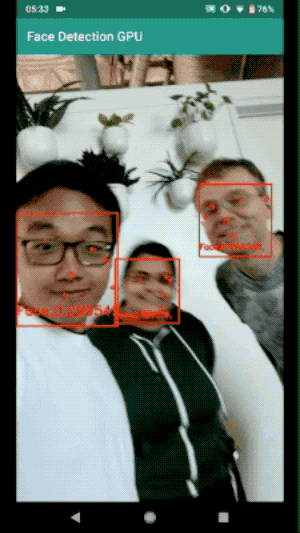
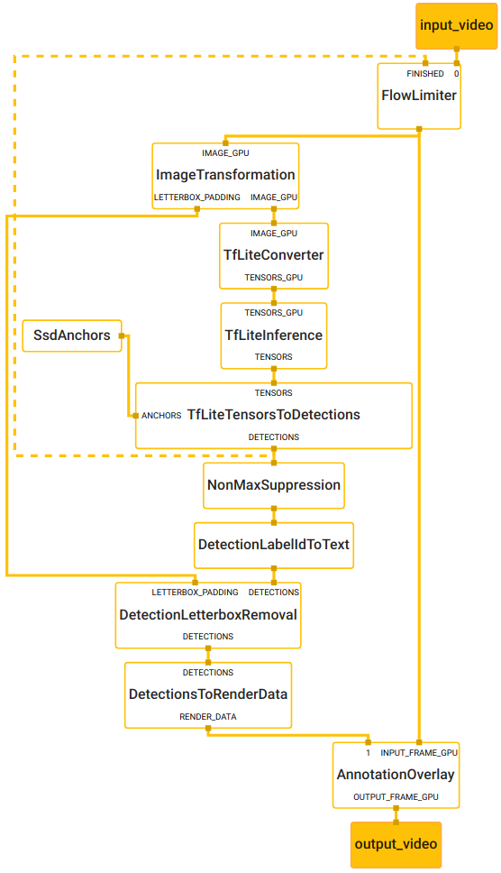

# Face Detection (GPU)

This doc focuses on the
[example graph](https://github.com/google/mediapipe/tree/master/mediapipe/graphs/face_detection/face_detection_mobile_gpu.pbtxt)
that performs face detection with TensorFlow Lite on GPU.

{width="300"}

## Android

Please see [Hello World! in MediaPipe on Android](hello_world_android.md) for
general instructions to develop an Android application that uses MediaPipe.

The graph is used in the
[Face Detection GPU](https://github.com/google/mediapipe/tree/master/mediapipe/examples/android/src/java/com/google/mediapipe/apps/facedetectiongpu)
example app. To build the app, run:

```bash
bazel build -c opt --config=android_arm64 mediapipe/examples/android/src/java/com/google/mediapipe/apps/facedetectiongpu
```

To further install the app on android device, run:

```bash
adb install bazel-bin/mediapipe/examples/android/src/java/com/google/mediapipe/apps/facedetectiongpu/facedetectiongpu.apk
```

## iOS

Please see [Hello World! in MediaPipe on iOS](hello_world_ios.md) for general
instructions to develop an iOS application that uses MediaPipe. The graph below
is used in the
[Face Detection GPU iOS example app](https://github.com/google/mediapipe/tree/master/mediapipe/examples/ios/facedetectiongpu).

To build the iOS app, please see the general
[MediaPipe iOS app building and setup instructions](./mediapipe_ios_setup.md).
Specifically, run:

```bash
bazel build -c opt --config=ios_arm64 mediapipe/examples/ios/facedetectiongpu:FaceDetectionGpuApp
```

## Graph

{width="400"}

To visualize the graph as shown above, copy the text specification of the graph
below and paste it into [MediaPipe Visualizer](https://viz.mediapipe.dev/).

```bash
# MediaPipe graph that performs face detection with TensorFlow Lite on GPU.
# Used in the example in
# mediapipie/examples/android/src/java/com/mediapipe/apps/facedetectiongpu and
# mediapipie/examples/ios/facedetectiongpu.

# Images on GPU coming into and out of the graph.
input_stream: "input_video"
output_stream: "output_video"

# Throttles the images flowing downstream for flow control. It passes through
# the very first incoming image unaltered, and waits for
# TfLiteTensorsToDetectionsCalculator downstream in the graph to finish
# generating the corresponding detections before it passes through another
# image. All images that come in while waiting are dropped, limiting the number
# of in-flight images between this calculator and
# TfLiteTensorsToDetectionsCalculator to 1. This prevents the nodes in between
# from queuing up incoming images and data excessively, which leads to increased
# latency and memory usage, unwanted in real-time mobile applications. It also
# eliminates unnecessarily computation, e.g., a transformed image produced by
# ImageTransformationCalculator may get dropped downstream if the subsequent
# TfLiteConverterCalculator or TfLiteInferenceCalculator is still busy
# processing previous inputs.
node {
  calculator: "FlowLimiterCalculator"
  input_stream: "input_video"
  input_stream: "FINISHED:detections"
  input_stream_info: {
    tag_index: "FINISHED"
    back_edge: true
  }
  output_stream: "throttled_input_video"
}

# Transforms the input image on GPU to a 128x128 image. To scale the input
# image, the scale_mode option is set to FIT to preserve the aspect ratio,
# resulting in potential letterboxing in the transformed image.
node: {
  calculator: "ImageTransformationCalculator"
  input_stream: "IMAGE_GPU:throttled_input_video"
  output_stream: "IMAGE_GPU:transformed_input_video"
  output_stream: "LETTERBOX_PADDING:letterbox_padding"
  node_options: {
    [type.googleapis.com/mediapipe.ImageTransformationCalculatorOptions] {
      output_width: 128
      output_height: 128
      scale_mode: FIT
    }
  }
}

# Converts the transformed input image on GPU into an image tensor stored as a
# TfLiteTensor.
node {
  calculator: "TfLiteConverterCalculator"
  input_stream: "IMAGE_GPU:transformed_input_video"
  output_stream: "TENSORS_GPU:image_tensor"
}

# Runs a TensorFlow Lite model on GPU that takes an image tensor and outputs a
# vector of tensors representing, for instance, detection boxes/keypoints and
# scores.
node {
  calculator: "TfLiteInferenceCalculator"
  input_stream: "TENSORS_GPU:image_tensor"
  output_stream: "TENSORS:detection_tensors"
  node_options: {
    [type.googleapis.com/mediapipe.TfLiteInferenceCalculatorOptions] {
      model_path: "face_detection_front.tflite"
    }
  }
}

# Generates a single side packet containing a vector of SSD anchors based on
# the specification in the options.
node {
  calculator: "SsdAnchorsCalculator"
  output_side_packet: "anchors"
  node_options: {
    [type.googleapis.com/mediapipe.SsdAnchorsCalculatorOptions] {
      num_layers: 4
      min_scale: 0.1484375
      max_scale: 0.75
      input_size_height: 128
      input_size_width: 128
      anchor_offset_x: 0.5
      anchor_offset_y: 0.5
      strides: 8
      strides: 16
      strides: 16
      strides: 16
      aspect_ratios: 1.0
      fixed_anchor_size: true
    }
  }
}

# Decodes the detection tensors generated by the TensorFlow Lite model, based on
# the SSD anchors and the specification in the options, into a vector of
# detections. Each detection describes a detected object.
node {
  calculator: "TfLiteTensorsToDetectionsCalculator"
  input_stream: "TENSORS:detection_tensors"
  input_side_packet: "ANCHORS:anchors"
  output_stream: "DETECTIONS:detections"
  node_options: {
    [type.googleapis.com/mediapipe.TfLiteTensorsToDetectionsCalculatorOptions] {
      num_classes: 1
      num_boxes: 896
      num_coords: 16
      box_coord_offset: 0
      keypoint_coord_offset: 4
      num_keypoints: 6
      num_values_per_keypoint: 2
      sigmoid_score: true
      score_clipping_thresh: 100.0
      reverse_output_order: true
      x_scale: 128.0
      y_scale: 128.0
      h_scale: 128.0
      w_scale: 128.0
      min_score_thresh: 0.75
    }
  }
}

# Performs non-max suppression to remove excessive detections.
node {
  calculator: "NonMaxSuppressionCalculator"
  input_stream: "detections"
  output_stream: "filtered_detections"
  node_options: {
    [type.googleapis.com/mediapipe.NonMaxSuppressionCalculatorOptions] {
      min_suppression_threshold: 0.3
      overlap_type: INTERSECTION_OVER_UNION
      algorithm: WEIGHTED
      return_empty_detections: true
    }
  }
}

# Maps detection label IDs to the corresponding label text ("Face"). The label
# map is provided in the label_map_path option.
node {
  calculator: "DetectionLabelIdToTextCalculator"
  input_stream: "filtered_detections"
  output_stream: "labeled_detections"
  node_options: {
    [type.googleapis.com/mediapipe.DetectionLabelIdToTextCalculatorOptions] {
      label_map_path: "face_detection_front_labelmap.txt"
    }
  }
}

# Adjusts detection locations (already normalized to [0.f, 1.f]) on the
# letterboxed image (after image transformation with the FIT scale mode) to the
# corresponding locations on the same image with the letterbox removed (the
# input image to the graph before image transformation).
node {
  calculator: "DetectionLetterboxRemovalCalculator"
  input_stream: "DETECTIONS:labeled_detections"
  input_stream: "LETTERBOX_PADDING:letterbox_padding"
  output_stream: "DETECTIONS:output_detections"
}

# Converts the detections to drawing primitives for annotation overlay.
node {
  calculator: "DetectionsToRenderDataCalculator"
  input_stream: "DETECTIONS:output_detections"
  output_stream: "RENDER_DATA:render_data"
  node_options: {
    [type.googleapis.com/mediapipe.DetectionsToRenderDataCalculatorOptions] {
      thickness: 10.0
      color { r: 255 g: 0 b: 0 }
    }
  }
}

# Draws annotations and overlays them on top of a GPU copy of the original
# image coming into the graph. The calculator assumes that image origin is
# always at the top-left corner and renders text accordingly.
node {
  calculator: "AnnotationOverlayCalculator"
  input_stream: "INPUT_FRAME_GPU:throttled_input_video"
  input_stream: "render_data"
  output_stream: "OUTPUT_FRAME_GPU:output_video"
}
```
