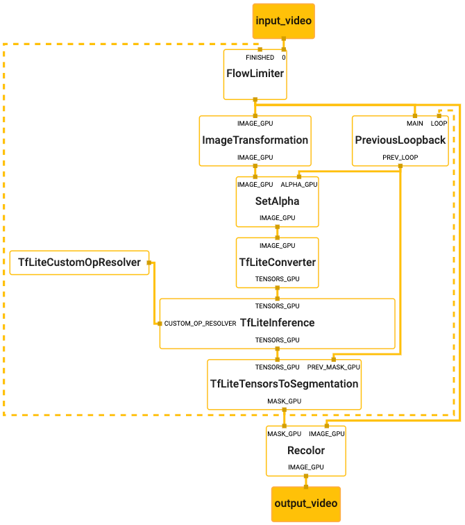

## Hair Segmentation on Desktop

This is an example of using MediaPipe to run hair segmentation models
(TensorFlow Lite) and render a color to the detected hair. To know more about
the hair segmentation models, please refer to the model [`README file`].
Moreover, if you are interested in running the same TensorfFlow Lite model on
Android/iOS, please see the
[Hair Segmentation on GPU on Android/iOS](hair_segmentation_mobile_gpu.md) and

We show the hair segmentation demos with TensorFlow Lite model using the Webcam:

-   [TensorFlow Lite Hair Segmentation Demo with Webcam (GPU)](#tensorflow-lite-hair-segmentation-demo-with-webcam-gpu)

Note: Desktop GPU works only on Linux. Mesa drivers need to be installed. Please
see
[step 4 of "Installing on Debian and Ubuntu" in the installation guide](./install.md).

Note: If MediaPipe depends on OpenCV 2, please see the [known issues with OpenCV 2](#known-issues-with-opencv-2) section.

### TensorFlow Lite Hair Segmentation Demo with Webcam (GPU)

To build and run the TensorFlow Lite example on desktop (GPU) with Webcam, run:

```bash
# Video from webcam running on desktop GPU
# This works only for linux currently
$ bazel build -c opt --copt -DMESA_EGL_NO_X11_HEADERS \
    mediapipe/examples/desktop/hair_segmentation:hair_segmentation_gpu

# It should print:
#INFO: Found 1 target...
#Target //mediapipe/examples/desktop/hair_segmentation:hair_segmentation_gpu up-to-date:
#  bazel-bin/mediapipe/examples/desktop/hair_segmentation/hair_segmentation_gpu
#INFO: Build completed successfully, 12210 total actions

# This will open up your webcam as long as it is connected and on
# Any errors is likely due to your webcam being not accessible,
# or GPU drivers not setup properly.
$ GLOG_logtostderr=1 bazel-bin/mediapipe/examples/desktop/hair_segmentation/hair_segmentation_gpu \
    --calculator_graph_config_file=mediapipe/graphs/hair_segmentation/hair_segmentation_mobile_gpu.pbtxt
```

#### Graph



To visualize the graph as shown above, copy the text specification of the graph
below and paste it into
[MediaPipe Visualizer](https://viz.mediapipe.dev).

```bash
# MediaPipe graph that performs hair segmentation with TensorFlow Lite on GPU.
# Used in the example in
# mediapipe/examples/android/src/java/com/mediapipe/apps/hairsegmentationgpu.

# Images on GPU coming into and out of the graph.
input_stream: "input_video"
output_stream: "output_video"

# Throttles the images flowing downstream for flow control. It passes through
# the very first incoming image unaltered, and waits for
# TfLiteTensorsToSegmentationCalculator downstream in the graph to finish
# generating the corresponding hair mask before it passes through another
# image. All images that come in while waiting are dropped, limiting the number
# of in-flight images between this calculator and
# TfLiteTensorsToSegmentationCalculator to 1. This prevents the nodes in between
# from queuing up incoming images and data excessively, which leads to increased
# latency and memory usage, unwanted in real-time mobile applications. It also
# eliminates unnecessarily computation, e.g., a transformed image produced by
# ImageTransformationCalculator may get dropped downstream if the subsequent
# TfLiteConverterCalculator or TfLiteInferenceCalculator is still busy
# processing previous inputs.
node {
  calculator: "FlowLimiterCalculator"
  input_stream: "input_video"
  input_stream: "FINISHED:hair_mask"
  input_stream_info: {
    tag_index: "FINISHED"
    back_edge: true
  }
  output_stream: "throttled_input_video"
}

# Transforms the input image on GPU to a 512x512 image. To scale the image, by
# default it uses the STRETCH scale mode that maps the entire input image to the
# entire transformed image. As a result, image aspect ratio may be changed and
# objects in the image may be deformed (stretched or squeezed), but the hair
# segmentation model used in this graph is agnostic to that deformation.
node: {
  calculator: "ImageTransformationCalculator"
  input_stream: "IMAGE_GPU:throttled_input_video"
  output_stream: "IMAGE_GPU:transformed_input_video"
  node_options: {
    [type.googleapis.com/mediapipe.ImageTransformationCalculatorOptions] {
      output_width: 512
      output_height: 512
    }
  }
}

# Caches a mask fed back from the previous round of hair segmentation, and upon
# the arrival of the next input image sends out the cached mask with the
# timestamp replaced by that of the input image, essentially generating a packet
# that carries the previous mask. Note that upon the arrival of the very first
# input image, an empty packet is sent out to jump start the feedback loop.
node {
  calculator: "PreviousLoopbackCalculator"
  input_stream: "MAIN:throttled_input_video"
  input_stream: "LOOP:hair_mask"
  input_stream_info: {
    tag_index: "LOOP"
    back_edge: true
  }
  output_stream: "PREV_LOOP:previous_hair_mask"
}

# Embeds the hair mask generated from the previous round of hair segmentation
# as the alpha channel of the current input image.
node {
  calculator: "SetAlphaCalculator"
  input_stream: "IMAGE_GPU:transformed_input_video"
  input_stream: "ALPHA_GPU:previous_hair_mask"
  output_stream: "IMAGE_GPU:mask_embedded_input_video"
}

# Converts the transformed input image on GPU into an image tensor stored in
# tflite::gpu::GlBuffer. The zero_center option is set to false to normalize the
# pixel values to [0.f, 1.f] as opposed to [-1.f, 1.f]. With the
# max_num_channels option set to 4, all 4 RGBA channels are contained in the
# image tensor.
node {
  calculator: "TfLiteConverterCalculator"
  input_stream: "IMAGE_GPU:mask_embedded_input_video"
  output_stream: "TENSORS_GPU:image_tensor"
  node_options: {
    [type.googleapis.com/mediapipe.TfLiteConverterCalculatorOptions] {
      zero_center: false
      max_num_channels: 4
    }
  }
}

# Generates a single side packet containing a TensorFlow Lite op resolver that
# supports custom ops needed by the model used in this graph.
node {
  calculator: "TfLiteCustomOpResolverCalculator"
  output_side_packet: "op_resolver"
  node_options: {
    [type.googleapis.com/mediapipe.TfLiteCustomOpResolverCalculatorOptions] {
      use_gpu: true
    }
  }
}

# Runs a TensorFlow Lite model on GPU that takes an image tensor and outputs a
# tensor representing the hair segmentation, which has the same width and height
# as the input image tensor.
node {
  calculator: "TfLiteInferenceCalculator"
  input_stream: "TENSORS_GPU:image_tensor"
  output_stream: "TENSORS_GPU:segmentation_tensor"
  input_side_packet: "CUSTOM_OP_RESOLVER:op_resolver"
  node_options: {
    [type.googleapis.com/mediapipe.TfLiteInferenceCalculatorOptions] {
      model_path: "mediapipe/models/hair_segmentation.tflite"
      use_gpu: true
    }
  }
}

# Decodes the segmentation tensor generated by the TensorFlow Lite model into a
# mask of values in [0.f, 1.f], stored in the R channel of a GPU buffer. It also
# takes the mask generated previously as another input to improve the temporal
# consistency.
node {
  calculator: "TfLiteTensorsToSegmentationCalculator"
  input_stream: "TENSORS_GPU:segmentation_tensor"
  input_stream: "PREV_MASK_GPU:previous_hair_mask"
  output_stream: "MASK_GPU:hair_mask"
  node_options: {
    [type.googleapis.com/mediapipe.TfLiteTensorsToSegmentationCalculatorOptions] {
      tensor_width: 512
      tensor_height: 512
      tensor_channels: 2
      combine_with_previous_ratio: 0.9
      output_layer_index: 1
    }
  }
}

# Colors the hair segmentation with the color specified in the option.
node {
  calculator: "RecolorCalculator"
  input_stream: "IMAGE_GPU:throttled_input_video"
  input_stream: "MASK_GPU:hair_mask"
  output_stream: "IMAGE_GPU:output_video"
  node_options: {
    [type.googleapis.com/mediapipe.RecolorCalculatorOptions] {
      color { r: 0 g: 0 b: 255 }
      mask_channel: RED
    }
  }
}
```

[`README file`]:https://github.com/google/mediapipe/tree/master/mediapipe/README.md
