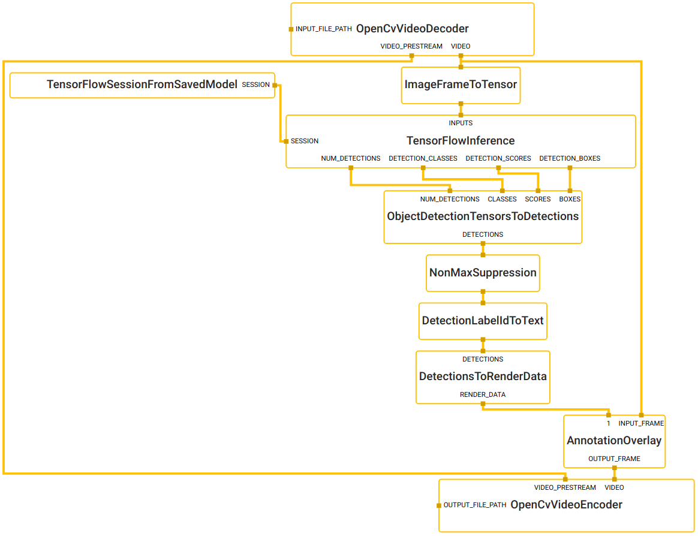
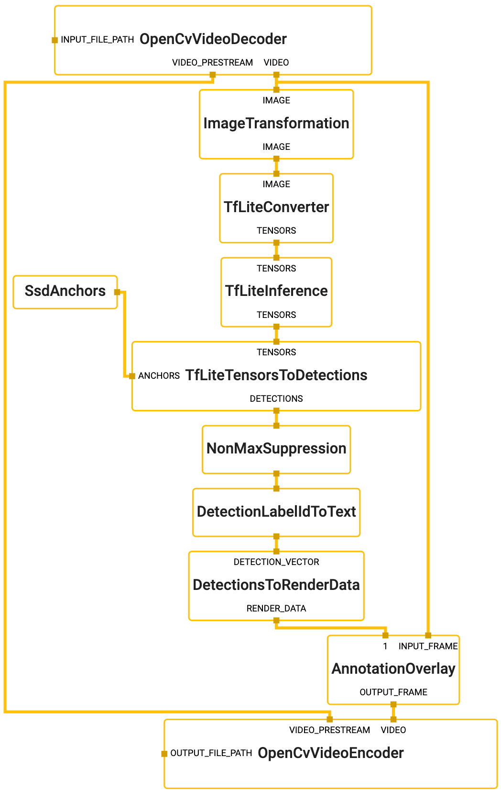

## Object Detection on Desktop

This is an example of using MediaPipe to run object detection models (TensorFlow
and TensorFlow Lite) and render bounding boxes on the detected objects. To know
more about the object detection models and TensorFlow-to-TFLite model
conversion, please refer to the model [`README file`]. Moreover, if you are
interested in running the same TensorfFlow Lite model on Android, please see the
[Object Detection on GPU on Android](object_detection_android_gpu.md) and
[Object Detection on CPU on Android](object_detection_android_cpu.md) examples.

We show the object detection demo with both TensorFlow model and TensorFlow Lite model:

-   [TensorFlow Object Detection Demo](#tensorflow-object-detection-demo)
-   [TensorFlow Lite Object Detection Demo](#tensorflow-lite-object-detection-demo)
-   [TensorFlow Lite Object Detection Demo with Webcam (CPU)](#tensorflow-lite-object-detection-demo)

Note: If MediaPipe depends on OpenCV 2, please see the [known issues with OpenCV 2](#known-issues-with-opencv-2) section.

### TensorFlow Object Detection Demo

To build and run the TensorFlow example on desktop, run:

```bash
# Note that this command also builds TensorFlow targets from scratch, it may
# take a long time (e.g., up to 30 mins) to build for the first time.
$ bazel build -c opt \
    --define MEDIAPIPE_DISABLE_GPU=1 \
    --define no_aws_support=true \
    mediapipe/examples/desktop/object_detection:object_detection_tensorflow

# It should print:
# Target //mediapipe/examples/desktop/object_detection:object_detection_tensorflow up-to-date:
#   bazel-bin/mediapipe/examples/desktop/object_detection/object_detection_tensorflow
# INFO: Elapsed time: 172.262s, Critical Path: 125.68s
# INFO: 2675 processes: 2673 linux-sandbox, 2 local.
# INFO: Build completed successfully, 2807 total actions

# Replace <input video path> and <output video path>.
# You can find a test video in mediapipe/examples/desktop/object_detection.
$ GLOG_logtostderr=1 bazel-bin/mediapipe/examples/desktop/object_detection/object_detection_tensorflow \
  --calculator_graph_config_file=mediapipe/graphs/object_detection/object_detection_desktop_tensorflow_graph.pbtxt \
  --input_side_packets=input_video_path=<input video path>,output_video_path=<output video path>
```

#### Graph



To visualize the graph as shown above, copy the text specification of the graph
below and paste it into
[MediaPipe Visualizer](https://viz.mediapipe.dev).

```bash
# MediaPipe graph that performs object detection on desktop with TensorFlow
# on CPU.
# Used in the example in
# mediapipe/examples/desktop/object_detection:object_detection_tensorflow.

# Decodes an input video file into images and a video header.
node {
  calculator: "OpenCvVideoDecoderCalculator"
  input_side_packet: "INPUT_FILE_PATH:input_video_path"
  output_stream: "VIDEO:input_video"
  output_stream: "VIDEO_PRESTREAM:input_video_header"
}

# Converts the input image into an image tensor as a tensorflow::Tensor.
node {
  calculator: "ImageFrameToTensorCalculator"
  input_stream: "input_video"
  output_stream: "image_tensor"
}

# Generates a single side packet containing a TensorFlow session from a saved
# model. The directory path that contains the saved model is specified in the
# saved_model_path option, and the name of the saved model file has to be
# "saved_model.pb".
node {
  calculator: "TensorFlowSessionFromSavedModelCalculator"
  output_side_packet: "SESSION:object_detection_session"
  node_options: {
    [type.googleapis.com/mediapipe.TensorFlowSessionFromSavedModelCalculatorOptions]: {
      saved_model_path: "mediapipe/models/object_detection_saved_model"
    }
  }
}

# Runs a TensorFlow session (specified as an input side packet) that takes an
# image tensor and outputs multiple tensors that describe the objects detected
# in the image. The batch_size option is set to 1 to disable batching entirely.
# Note that the particular TensorFlow model used in this session handles image
# scaling internally before the object-detection inference, and therefore no
# additional calculator for image transformation is needed in this MediaPipe
# graph.
node: {
  calculator: "TensorFlowInferenceCalculator"
  input_side_packet: "SESSION:object_detection_session"
  input_stream: "INPUTS:image_tensor"
  output_stream: "DETECTION_BOXES:detection_boxes_tensor"
  output_stream: "DETECTION_CLASSES:detection_classes_tensor"
  output_stream: "DETECTION_SCORES:detection_scores_tensor"
  output_stream: "NUM_DETECTIONS:num_detections_tensor"
  node_options: {
    [type.googleapis.com/mediapipe.TensorFlowInferenceCalculatorOptions]: {
      batch_size: 1
    }
  }
}

# Decodes the detection tensors from the TensorFlow model into a vector of
# detections. Each detection describes a detected object.
node {
  calculator: "ObjectDetectionTensorsToDetectionsCalculator"
  input_stream: "BOXES:detection_boxes_tensor"
  input_stream: "SCORES:detection_scores_tensor"
  input_stream: "CLASSES:detection_classes_tensor"
  input_stream: "NUM_DETECTIONS:num_detections_tensor"
  output_stream: "DETECTIONS:detections"
}

# Performs non-max suppression to remove excessive detections.
node {
  calculator: "NonMaxSuppressionCalculator"
  input_stream: "detections"
  output_stream: "filtered_detections"
  node_options: {
    [type.googleapis.com/mediapipe.NonMaxSuppressionCalculatorOptions] {
      min_suppression_threshold: 0.4
      min_score_threshold: 0.6
      max_num_detections: 10
      overlap_type: INTERSECTION_OVER_UNION
    }
  }
}

# Maps detection label IDs to the corresponding label text. The label map is
# provided in the label_map_path option.
node {
  calculator: "DetectionLabelIdToTextCalculator"
  input_stream: "filtered_detections"
  output_stream: "output_detections"
  node_options: {
    [type.googleapis.com/mediapipe.DetectionLabelIdToTextCalculatorOptions] {
      label_map_path: "mediapipe/models/ssdlite_object_detection_labelmap.txt"
    }
  }
}

# Converts the detections to drawing primitives for annotation overlay.
node {
  calculator: "DetectionsToRenderDataCalculator"
  input_stream: "DETECTION_VECTOR:output_detections"
  output_stream: "RENDER_DATA:render_data"
  node_options: {
    [type.googleapis.com/mediapipe.DetectionsToRenderDataCalculatorOptions] {
      thickness: 4.0
      color { r: 255 g: 0 b: 0 }
    }
  }
}

# Draws annotations and overlays them on top of the original image coming into
# the graph.
node {
  calculator: "AnnotationOverlayCalculator"
  input_stream: "INPUT_FRAME:input_video"
  input_stream: "render_data"
  output_stream: "OUTPUT_FRAME:output_video"
}

# Encodes the annotated images into a video file, adopting properties specified
# in the input video header, e.g., video framerate.
node {
  calculator: "OpenCvVideoEncoderCalculator"
  input_stream: "VIDEO:output_video"
  input_stream: "VIDEO_PRESTREAM:input_video_header"
  input_side_packet: "OUTPUT_FILE_PATH:output_video_path"
  node_options: {
    [type.googleapis.com/mediapipe.OpenCvVideoEncoderCalculatorOptions]: {
      codec: "avc1"
      video_format: "mp4"
    }
  }
}
```

### TensorFlow Lite Object Detection Demo

To build and run the TensorFlow Lite example on desktop, run:

```bash
$ bazel build -c opt --define MEDIAPIPE_DISABLE_GPU=1 \
    mediapipe/examples/desktop/object_detection:object_detection_tflite

# It should print:
# Target //mediapipe/examples/desktop/object_detection:object_detection_tflite up-to-date:
#   bazel-bin/mediapipe/examples/desktop/object_detection/object_detection_tflite
# INFO: Elapsed time: 36.417s, Critical Path: 23.22s
# INFO: 711 processes: 710 linux-sandbox, 1 local.
# INFO: Build completed successfully, 734 total actions

# Replace <input video path> and <output video path>.
# You can find a test video in mediapipe/examples/desktop/object_detection.
$ GLOG_logtostderr=1 bazel-bin/mediapipe/examples/desktop/object_detection/object_detection_tflite \
    --calculator_graph_config_file=mediapipe/graphs/object_detection/object_detection_desktop_tflite_graph.pbtxt \
    --input_side_packets=input_video_path=<input video path>,output_video_path=<output video path>
```

### TensorFlow Lite Object Detection Demo with Webcam (CPU)

To build and run the TensorFlow Lite example on desktop (CPU) with Webcam, run:

```bash
# Video from webcam running on desktop CPU
$ bazel build -c opt --define MEDIAPIPE_DISABLE_GPU=1 \
    mediapipe/examples/desktop/object_detection:object_detection_cpu
# It should print:
#Target //mediapipe/examples/desktop/object_detection:object_detection_cpu up-to-date:
#  bazel-bin/mediapipe/examples/desktop/object_detection/object_detection_cpu
#INFO: Build completed successfully, 12154 total actions

# This will open up your webcam as long as it is connected and on
# Any errors is likely due to your webcam being not accessible
$ GLOG_logtostderr=1 bazel-bin/mediapipe/examples/desktop/object_detection/object_detection_cpu \
    --calculator_graph_config_file=mediapipe/graphs/object_detection/object_detection_desktop_live.pbtxt
```

#### Graph



To visualize the graph as shown above, copy the text specification of the graph
below and paste it into
[MediaPipe Visualizer](https://viz.mediapipe.dev).

```bash
# MediaPipe graph that performs object detection on desktop with TensorFlow Lite
# on CPU.
# Used in the example in
# mediapipe/examples/desktop/object_detection:object_detection_tflite.

# max_queue_size limits the number of packets enqueued on any input stream
# by throttling inputs to the graph. This makes the graph only process one
# frame per time.
max_queue_size: 1

# Decodes an input video file into images and a video header.
node {
  calculator: "OpenCvVideoDecoderCalculator"
  input_side_packet: "INPUT_FILE_PATH:input_video_path"
  output_stream: "VIDEO:input_video"
  output_stream: "VIDEO_PRESTREAM:input_video_header"
}

# Transforms the input image on CPU to a 320x320 image. To scale the image, by
# default it uses the STRETCH scale mode that maps the entire input image to the
# entire transformed image. As a result, image aspect ratio may be changed and
# objects in the image may be deformed (stretched or squeezed), but the object
# detection model used in this graph is agnostic to that deformation.
node: {
  calculator: "ImageTransformationCalculator"
  input_stream: "IMAGE:input_video"
  output_stream: "IMAGE:transformed_input_video"
  node_options: {
    [type.googleapis.com/mediapipe.ImageTransformationCalculatorOptions] {
      output_width: 320
      output_height: 320
    }
  }
}

# Converts the transformed input image on CPU into an image tensor as a
# TfLiteTensor. The zero_center option is set to true to normalize the
# pixel values to [-1.f, 1.f] as opposed to [0.f, 1.f].
node {
  calculator: "TfLiteConverterCalculator"
  input_stream: "IMAGE:transformed_input_video"
  output_stream: "TENSORS:image_tensor"
  node_options: {
    [type.googleapis.com/mediapipe.TfLiteConverterCalculatorOptions] {
      zero_center: true
    }
  }
}

# Runs a TensorFlow Lite model on CPU that takes an image tensor and outputs a
# vector of tensors representing, for instance, detection boxes/keypoints and
# scores.
node {
  calculator: "TfLiteInferenceCalculator"
  input_stream: "TENSORS:image_tensor"
  output_stream: "TENSORS:detection_tensors"
  node_options: {
    [type.googleapis.com/mediapipe.TfLiteInferenceCalculatorOptions] {
      model_path: "mediapipe/models/ssdlite_object_detection.tflite"
    }
  }
}

# Generates a single side packet containing a vector of SSD anchors based on
# the specification in the options.
node {
  calculator: "SsdAnchorsCalculator"
  output_side_packet: "anchors"
  node_options: {
    [type.googleapis.com/mediapipe.SsdAnchorsCalculatorOptions] {
      num_layers: 6
      min_scale: 0.2
      max_scale: 0.95
      input_size_height: 320
      input_size_width: 320
      anchor_offset_x: 0.5
      anchor_offset_y: 0.5
      strides: 16
      strides: 32
      strides: 64
      strides: 128
      strides: 256
      strides: 512
      aspect_ratios: 1.0
      aspect_ratios: 2.0
      aspect_ratios: 0.5
      aspect_ratios: 3.0
      aspect_ratios: 0.3333
      reduce_boxes_in_lowest_layer: true
    }
  }
}

# Decodes the detection tensors generated by the TensorFlow Lite model, based on
# the SSD anchors and the specification in the options, into a vector of
# detections. Each detection describes a detected object.
node {
  calculator: "TfLiteTensorsToDetectionsCalculator"
  input_stream: "TENSORS:detection_tensors"
  input_side_packet: "ANCHORS:anchors"
  output_stream: "DETECTIONS:detections"
  node_options: {
    [type.googleapis.com/mediapipe.TfLiteTensorsToDetectionsCalculatorOptions] {
      num_classes: 91
      num_boxes: 2034
      num_coords: 4
      ignore_classes: 0
      apply_exponential_on_box_size: true

      x_scale: 10.0
      y_scale: 10.0
      h_scale: 5.0
      w_scale: 5.0
    }
  }
}

# Performs non-max suppression to remove excessive detections.
node {
  calculator: "NonMaxSuppressionCalculator"
  input_stream: "detections"
  output_stream: "filtered_detections"
  node_options: {
    [type.googleapis.com/mediapipe.NonMaxSuppressionCalculatorOptions] {
      min_suppression_threshold: 0.4
      min_score_threshold: 0.6
      max_num_detections: 5
      overlap_type: INTERSECTION_OVER_UNION
    }
  }
}

# Maps detection label IDs to the corresponding label text. The label map is
# provided in the label_map_path option.
node {
  calculator: "DetectionLabelIdToTextCalculator"
  input_stream: "filtered_detections"
  output_stream: "output_detections"
  node_options: {
    [type.googleapis.com/mediapipe.DetectionLabelIdToTextCalculatorOptions] {
      label_map_path: "mediapipe/models/ssdlite_object_detection_labelmap.txt"
    }
  }
}

# Converts the detections to drawing primitives for annotation overlay.
node {
  calculator: "DetectionsToRenderDataCalculator"
  input_stream: "DETECTION_VECTOR:output_detections"
  output_stream: "RENDER_DATA:render_data"
  node_options: {
    [type.googleapis.com/mediapipe.DetectionsToRenderDataCalculatorOptions] {
      thickness: 4.0
      color { r: 255 g: 0 b: 0 }
    }
  }
}

# Draws annotations and overlays them on top of the original image coming into
# the graph.
node {
  calculator: "AnnotationOverlayCalculator"
  input_stream: "INPUT_FRAME:input_video"
  input_stream: "render_data"
  output_stream: "OUTPUT_FRAME:output_video"
}

# Encodes the annotated images into a video file, adopting properties specified
# in the input video header, e.g., video framerate.
node {
  calculator: "OpenCvVideoEncoderCalculator"
  input_stream: "VIDEO:output_video"
  input_stream: "VIDEO_PRESTREAM:input_video_header"
  input_side_packet: "OUTPUT_FILE_PATH:output_video_path"
  node_options: {
    [type.googleapis.com/mediapipe.OpenCvVideoEncoderCalculatorOptions]: {
      codec: "avc1"
      video_format: "mp4"
    }
  }
}
```

### Known issues with OpenCV 2

Note that OpenCV 2 may not be able to render an mp4 file and returns the
following error message:

```
[libx264 @ 0x7fe6eadf49a0] broken ffmpeg default settings detected
[libx264 @ 0x7fe6eadf49a0] use an encoding preset (e.g. -vpre medium)
[libx264 @ 0x7fe6eadf49a0] preset usage: -vpre <speed> -vpre <profile>
[libx264 @ 0x7fe6eadf49a0] speed presets are listed in x264 --help
[libx264 @ 0x7fe6eadf49a0] profile is optional; x264 defaults to high
Could not open codec 'libx264': Unspecified errorE0612 19:40:09.067003  2089 simple_run_graph_main.cc:64] Fail to run the graph: CalculatorGraph::Run() failed in Run:
Calculator::Process() for node "[OpenCvVideoEncoderCalculator, OpenCvVideoEncoderCalculator with node ID: 7 and input streams: <decorated_frames,video_prestream>]" failed: ; Fail to open file at ...
```

In that case, please change the OpenCvVideoEncoderCalculator option in either
the [`TensorFlow graph`] or the [`TensorFlow Lite graph`] to the following and
in the command line specify the output video to be a .mkv file.

```bash
node {
  calculator: "OpenCvVideoEncoderCalculator"
  input_stream: "VIDEO:output_video"
  input_stream: "VIDEO_PRESTREAM:input_video_header"
  input_side_packet: "OUTPUT_FILE_PATH:output_video_path"
  node_options {
    [type.googleapis.com/mediapipe.OpenCvVideoEncoderCalculatorOptions]: {
      codec: "MPEG"
     video_format: "mkv"
  }
}
```

[`README file`]:https://github.com/google/mediapipe/tree/master/mediapipe/models/object_detection_saved_model/README.md
[`TensorFlow graph`]: https://github.com/google/mediapipe/tree/master/mediapipe/graphs/object_detection/object_detection_desktop_tensorflow_graph.pbtxt
[`TensorFlow Lite graph`]: https://github.com/google/mediapipe/tree/master/mediapipe/graphs/object_detection/object_detection_desktop_tflite_graph.pbtxt
