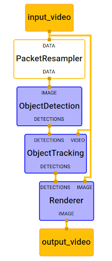
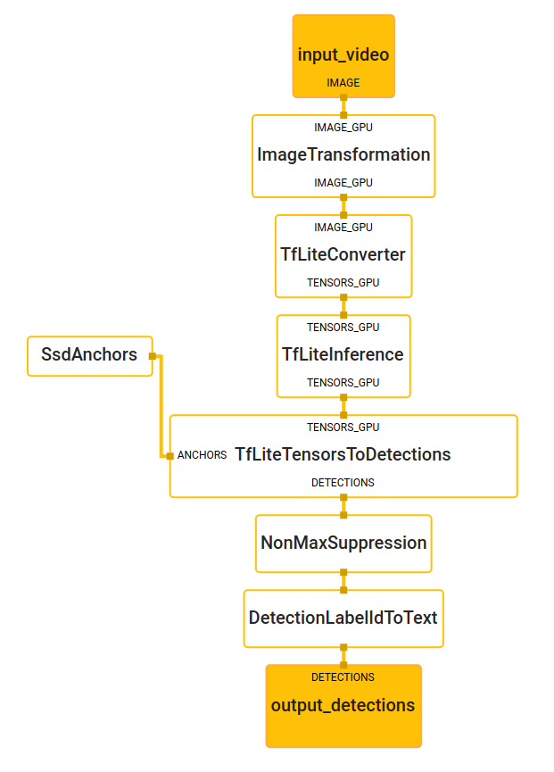
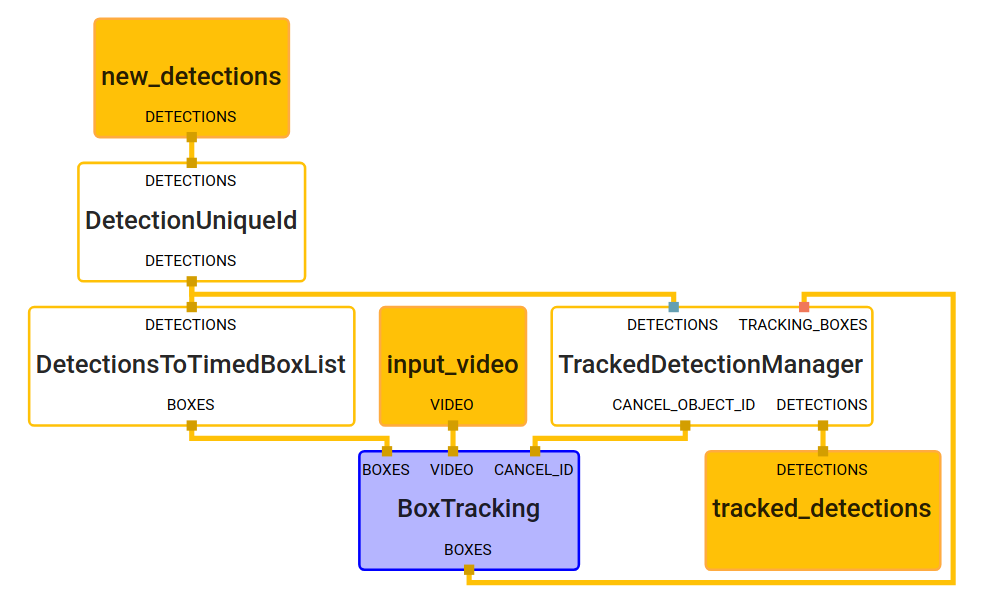
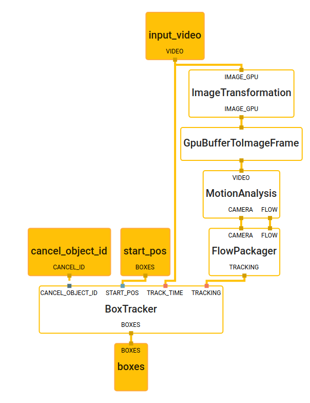
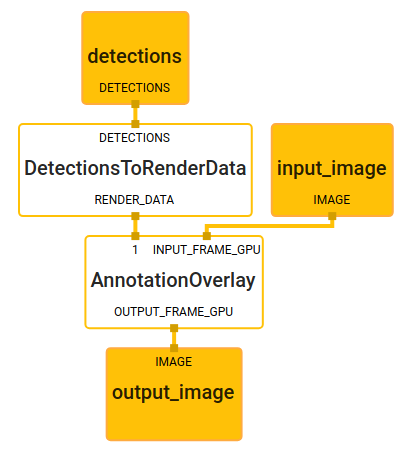

# Object Detection and Tracking

This doc focuses on the
[below example graph](https://github.com/google/mediapipe/tree/master/mediapipe/graphs/tracking/object_detection_tracking_mobile_gpu.pbtxt)
that performs object detection and tracking.
Note that object detection is using TensorFlow Lite on GPU while tracking is using CPU.

For overall context on hand detection and hand tracking, please read this
[Google Developer Blog](https://mediapipe.page.link/objecttrackingblog).


## Android

[Source](https://github.com/google/mediapipe/tree/master/mediapipe/examples/android/src/java/com/google/mediapipe/apps/objecttrackinggpu)

To build and install the app:

```bash
bazel build -c opt --config=android_arm64 mediapipe/examples/android/src/java/com/google/mediapipe/apps/objecttrackinggpu
```

Once the app is built, install it on Android device with:

```bash
adb install bazel-bin/mediapipe/examples/android/src/java/com/google/mediapipe/apps/objecttrackinggpu/objecttrackinggpu.apk
```

## Graph
The object detection and tracking [main graph](#main-graph) internally utilizes a
[object detection subgraph](#object-detection-subgraph), a
[object tracking subgraph](#object-tracking-subgraph) and a
[renderer subgraph](#renderer-subgraph).


The subgraphs show up in the main graph visualization as nodes colored in
purple, and the subgraph itself can also be visualized just like a regular
graph. For more information on how to visualize a graph that includes subgraphs,
see the Visualizing Subgraphs section in the
[visualizer documentation](./visualizer.md).

### Main Graph




[Source pbtxt file](https://github.com/google/mediapipe/tree/master/mediapipe/graphs/object_detection/object_detection_mobile_gpu.pbtxt)

```bash
# MediaPipe graph that performs object detection and tracking.
# Used in the examples in
# mediapipie/examples/android/src/java/com/mediapipe/apps/objecttrackinggpu

# Images on GPU coming into and out of the graph.
input_stream: "input_video"
output_stream: "output_video"

# Resamples the images by specific frame rate. This calculator is used to
# control the frequecy of subsequent calculators/subgraphs, e.g. less power
# consumption for expensive process.
node {
  calculator: "PacketResamplerCalculator"
  input_stream: "DATA:input_video"
  output_stream: "DATA:throttled_input_video"
  node_options: {
    [type.googleapis.com/mediapipe.PacketResamplerCalculatorOptions] {
      frame_rate: 0.5
    }
  }
}

# Subgraph that detections objects (see object_detection_gpu.pbtxt).
node {
  calculator: "ObjectDetectionSubgraph"
  input_stream: "IMAGE:throttled_input_video"
  output_stream: "DETECTIONS:output_detections"
}

# Subgraph that tracks objects (see object_tracking.pbtxt).
node {
  calculator: "ObjectTrackingSubgraph"
  input_stream: "VIDEO:input_video"
  input_stream: "DETECTIONS:output_detections"
  output_stream: "DETECTIONS:tracked_detections"
}

# Subgraph that renders annotations and overlays them on top of the input
# images (see renderer_gpu.pbtxt).
node {
  calculator: "RendererSubgraph"
  input_stream: "IMAGE:input_video"
  input_stream: "DETECTIONS:tracked_detections"
  output_stream: "IMAGE:output_video"
}
```

### Object Detection Subgraph



[Source pbtxt file](https://github.com/google/mediapipe/tree/master/mediapipe/graphs/tracking/subgraphs/object_detection_gpu.pbtxt)

```bash
# MediaPipe object detection subgraph.

type: "ObjectDetectionSubgraph"

input_stream: "IMAGE:input_video"
output_stream: "DETECTIONS:output_detections"

# Transforms the input image on GPU to a 320x320 image. To scale the image, by
# default it uses the STRETCH scale mode that maps the entire input image to the
# entire transformed image. As a result, image aspect ratio may be changed and
# objects in the image may be deformed (stretched or squeezed), but the object
# detection model used in this graph is agnostic to that deformation.
node: {
  calculator: "ImageTransformationCalculator"
  input_stream: "IMAGE_GPU:input_video"
  output_stream: "IMAGE_GPU:transformed_input_video"
  node_options: {
    [type.googleapis.com/mediapipe.ImageTransformationCalculatorOptions] {
      output_width: 320
      output_height: 320
    }
  }
}

# Converts the transformed input image on GPU into an image tensor stored as a
# TfLiteTensor.
node {
  calculator: "TfLiteConverterCalculator"
  input_stream: "IMAGE_GPU:transformed_input_video"
  output_stream: "TENSORS_GPU:image_tensor"
}

# Runs a TensorFlow Lite model on GPU that takes an image tensor and outputs a
# vector of tensors representing, for instance, detection boxes/keypoints and
# scores.
node {
  calculator: "TfLiteInferenceCalculator"
  input_stream: "TENSORS_GPU:image_tensor"
  output_stream: "TENSORS_GPU:detection_tensors"
  node_options: {
    [type.googleapis.com/mediapipe.TfLiteInferenceCalculatorOptions] {
      model_path: "mediapipe/models/ssdlite_object_detection.tflite"
    }
  }
}

# Generates a single side packet containing a vector of SSD anchors based on
# the specification in the options.
node {
  calculator: "SsdAnchorsCalculator"
  output_side_packet: "anchors"
  node_options: {
    [type.googleapis.com/mediapipe.SsdAnchorsCalculatorOptions] {
      num_layers: 6
      min_scale: 0.2
      max_scale: 0.95
      input_size_height: 320
      input_size_width: 320
      anchor_offset_x: 0.5
      anchor_offset_y: 0.5
      strides: 16
      strides: 32
      strides: 64
      strides: 128
      strides: 256
      strides: 512
      aspect_ratios: 1.0
      aspect_ratios: 2.0
      aspect_ratios: 0.5
      aspect_ratios: 3.0
      aspect_ratios: 0.3333
      reduce_boxes_in_lowest_layer: true
    }
  }
}

# Decodes the detection tensors generated by the TensorFlow Lite model, based on
# the SSD anchors and the specification in the options, into a vector of
# detections. Each detection describes a detected object.
node {
  calculator: "TfLiteTensorsToDetectionsCalculator"
  input_stream: "TENSORS_GPU:detection_tensors"
  input_side_packet: "ANCHORS:anchors"
  output_stream: "DETECTIONS:detections"
  node_options: {
    [type.googleapis.com/mediapipe.TfLiteTensorsToDetectionsCalculatorOptions] {
      num_classes: 91
      num_boxes: 2034
      num_coords: 4
      ignore_classes: 0
      sigmoid_score: true
      apply_exponential_on_box_size: true
      x_scale: 10.0
      y_scale: 10.0
      h_scale: 5.0
      w_scale: 5.0
      min_score_thresh: 0.6
    }
  }
}

# Performs non-max suppression to remove excessive detections.
node {
  calculator: "NonMaxSuppressionCalculator"
  input_stream: "detections"
  output_stream: "filtered_detections"
  node_options: {
    [type.googleapis.com/mediapipe.NonMaxSuppressionCalculatorOptions] {
      min_suppression_threshold: 0.4
      max_num_detections: 3
      overlap_type: INTERSECTION_OVER_UNION
      return_empty_detections: true
    }
  }
}

# Maps detection label IDs to the corresponding label text. The label map is
# provided in the label_map_path option.
node {
  calculator: "DetectionLabelIdToTextCalculator"
  input_stream: "filtered_detections"
  output_stream: "output_detections"
  node_options: {
    [type.googleapis.com/mediapipe.DetectionLabelIdToTextCalculatorOptions] {
      label_map_path: "mediapipe/models/ssdlite_object_detection_labelmap.txt"
    }
  }
}
```

### Object Tracking Subgraph

Object tracking subgraph uses a box tracking subgraph which is a generic
tracking library that can be used for other use cases.



[Source pbtxt file](https://github.com/google/mediapipe/tree/master/mediapipe/graphs/tracking/subgraphs/object_tracking.pbtxt)

```bash
# MediaPipe object tracking subgraph.

type: "ObjectTrackingSubgraph"

input_stream: "VIDEO:input_video"
input_stream: "DETECTIONS:new_detections"
output_stream: "DETECTIONS:tracked_detections"

# Assigns an unique id for each new detection.
node {
  calculator: "DetectionUniqueIdCalculator"
  input_stream: "DETECTIONS:new_detections"
  output_stream: "DETECTIONS:detections_with_id"
}

# Converts detections to TimedBox protos which are used as initial location
# for tracking.
node {
  calculator: "DetectionsToTimedBoxListCalculator"
  input_stream: "DETECTIONS:detections_with_id"
  output_stream: "BOXES:start_pos"
}

# Subgraph that tracks boxes (see box_tracking.pbtxt).
node {
  calculator: "BoxTrackingSubgraph"
  input_stream: "VIDEO:input_video"
  input_stream: "BOXES:start_pos"
  input_stream: "CANCEL_ID:cancel_object_id"
  output_stream: "BOXES:boxes"
}

# Managers new detected objects and objects that are being tracked.
# It associates the duplicated detections and updates the locations of
# detections from tracking.
node: {
  calculator: "TrackedDetectionManagerCalculator"
  input_stream: "DETECTIONS:detections_with_id"
  input_stream: "TRACKING_BOXES:boxes"
  output_stream: "DETECTIONS:tracked_detections"
  output_stream: "CANCEL_OBJECT_ID:cancel_object_id"

  input_stream_handler {
    input_stream_handler: "SyncSetInputStreamHandler"
    options {
      [mediapipe.SyncSetInputStreamHandlerOptions.ext] {
        sync_set {
          tag_index: "TRACKING_BOXES"
        }
        sync_set {
          tag_index: "DETECTIONS"
        }
      }
    }
  }
}

```

### Box Tracking Subgraph



[Source pbtxt file](https://github.com/google/mediapipe/tree/master/mediapipe/graphs/tracking/subgraphs/box_tracking.pbtxt)

```bash
# MediaPipe box tracking subgraph.

type: "BoxTrackingSubgraph"

input_stream: "VIDEO:input_video"
input_stream: "BOXES:start_pos"
input_stream: "CANCEL_ID:cancel_object_id"
output_stream: "BOXES:boxes"

node: {
  calculator: "ImageTransformationCalculator"
  input_stream: "IMAGE_GPU:input_video"
  output_stream: "IMAGE_GPU:downscaled_input_video"
  node_options: {
    [type.googleapis.com/mediapipe.ImageTransformationCalculatorOptions] {
      output_width: 240
      output_height: 320
    }
  }
}

# Converts GPU buffer to ImageFrame for processing tracking.
node: {
  calculator: "GpuBufferToImageFrameCalculator"
  input_stream: "downscaled_input_video"
  output_stream: "downscaled_input_video_cpu"
}

# Performs motion analysis on an incoming video stream.
node: {
  calculator: "MotionAnalysisCalculator"
  input_stream: "VIDEO:downscaled_input_video_cpu"
  output_stream: "CAMERA:camera_motion"
  output_stream: "FLOW:region_flow"

  node_options: {
    [type.googleapis.com/mediapipe.MotionAnalysisCalculatorOptions]: {
      analysis_options {
        analysis_policy: ANALYSIS_POLICY_CAMERA_MOBILE
        flow_options {
          fast_estimation_min_block_size: 100
          top_inlier_sets: 1
          frac_inlier_error_threshold: 3e-3
          downsample_mode: DOWNSAMPLE_TO_INPUT_SIZE
          verification_distance: 5.0
          verify_long_feature_acceleration: true
          verify_long_feature_trigger_ratio: 0.1
          tracking_options {
            max_features: 500
            adaptive_extraction_levels: 2
            min_eig_val_settings {
              adaptive_lowest_quality_level: 2e-4
            }
            klt_tracker_implementation: KLT_OPENCV
          }
        }
      }
    }
  }
}

# Reads optical flow fields defined in
# mediapipe/framework/formats/motion/optical_flow_field.h,
# returns a VideoFrame with 2 channels (v_x and v_y), each channel is quantized
# to 0-255.
node: {
  calculator: "FlowPackagerCalculator"
  input_stream: "FLOW:region_flow"
  input_stream: "CAMERA:camera_motion"
  output_stream: "TRACKING:tracking_data"

  node_options: {
    [type.googleapis.com/mediapipe.FlowPackagerCalculatorOptions]: {
      flow_packager_options: {
        binary_tracking_data_support: false
      }
    }
  }
}

# Tracks box positions over time.
node: {
  calculator: "BoxTrackerCalculator"
  input_stream: "TRACKING:tracking_data"
  input_stream: "TRACK_TIME:input_video"
  input_stream: "START_POS:start_pos"
  input_stream: "CANCEL_OBJECT_ID:cancel_object_id"
  input_stream_info: {
    tag_index: "CANCEL_OBJECT_ID"
    back_edge: true
  }
  output_stream: "BOXES:boxes"

  input_stream_handler {
    input_stream_handler: "SyncSetInputStreamHandler"
    options {
      [mediapipe.SyncSetInputStreamHandlerOptions.ext] {
        sync_set {
          tag_index: "TRACKING"
          tag_index: "TRACK_TIME"
        }
        sync_set {
          tag_index: "START_POS"
        }
        sync_set {
          tag_index: "CANCEL_OBJECT_ID"
        }
      }
    }
  }

  node_options: {
    [type.googleapis.com/mediapipe.BoxTrackerCalculatorOptions]: {
      tracker_options: {
        track_step_options {
          track_object_and_camera: true
          tracking_degrees: TRACKING_DEGREE_OBJECT_SCALE
          inlier_spring_force: 0.0
          static_motion_temporal_ratio: 3e-2
        }
      }
      visualize_tracking_data: false
      streaming_track_data_cache_size: 100
    }
  }
}
```

### Renderer Subgraph



[Source pbtxt file](https://github.com/google/mediapipe/tree/master/mediapipe/graphs/tracking/subgraphs/renderer_gpu.pbtxt)

```bash
# MediaPipe object tracking rendering subgraph.

type: "RendererSubgraph"

input_stream: "IMAGE:input_image"
input_stream: "DETECTIONS:detections"
output_stream: "IMAGE:output_image"

# Converts the detections to drawing primitives for annotation overlay.
node {
  calculator: "DetectionsToRenderDataCalculator"
  input_stream: "DETECTIONS:detections"
  output_stream: "RENDER_DATA:detections_render_data"
  node_options: {
    [type.googleapis.com/mediapipe.DetectionsToRenderDataCalculatorOptions] {
      thickness: 4.0
      color { r: 255 g: 0 b: 0 }
      render_detection_id: true
    }
  }
}

# Draws annotations and overlays them on top of the input images.
node {
  calculator: "AnnotationOverlayCalculator"
  input_stream: "INPUT_FRAME_GPU:input_image"
  input_stream: "detections_render_data"
  output_stream: "OUTPUT_FRAME_GPU:output_image"
}

```
