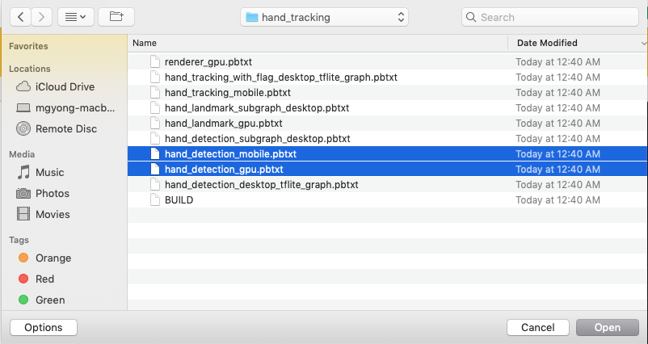
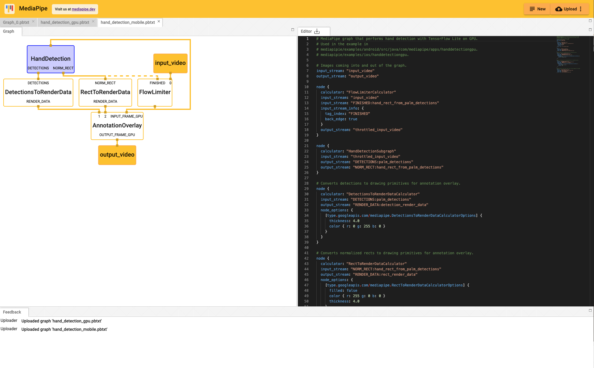

## Visualizing MediaPipe Graphs

-   [Working within the editor](#working-within-the-editor)
-   [Understanding the graph](#understanding-the-graph)

To help users understand the structure of their calculator graphs and to
understand the overall behavior of their machine learning inference pipelines,
we have built the [MediaPipe Visualizer](https://viz.mediapipe.dev/)
that is available online.

*   A graph view allows users to see a connected calculator graph as expressed
    through a graph configuration that is pasted into the graph editor or
    uploaded. The user can visualize and troubleshoot a graph they have created.

    {width="800"}

### Working within the editor

Getting Started:

The graph can be modified by adding and editing code in the Editor view.

{width="600"}

*   Pressing the "New" button in the upper right corner will clear any existing
    code in the Editor window.

    {width="300"}

*   Pressing the "Upload" button will prompt the user to select a local PBTXT
    file, which will everwrite the current code within the editor.

*   Alternatively, code can be pasted directly into the editor window.

*   Errors and informational messages will appear in the Feedback window.

    {width="400"}

### Understanding the Graph

The visualizer graph shows the connections between calculator nodes.

*   Streams exit from the bottom of the calculator producing the stream and
    enter the top of any calculator receiving the stream. (Notice the use of the
    key, "input_stream" and "output_stream").

    {width="350"}
    {width="350"}

*   Sidepackets work the same, except that they exit a node on the right and
    enter on the left. (Notice the use of the key, "input_side_packet" and
    "output_side_packet").

    {width="350"}
    {width="350"}

*   There are special nodes that represent inputs and outputs to the graph and
    can supply either side packets or streams.

    {width="350"}
    {width="350"}

### Visualizing subgraphs

The MediaPipe visualizer can display multiple graphs. If a graph has a name (designated by assigning a string to the "type" field in the top level of the graph's proto file) and that name is used as a calculator name in a separate graph, it is considered a subgraph and colored appropriately where it is used.  Clicking on a subgraph will navigate to the corresponding tab which holds the subgraph's definition. In this example, for hand detection GPU we have 2 pbtxt files:
[hand_detection_mobile.pbtxt](https://github.com/google/mediapipe/tree/master/mediapipe/graphs/hand_tracking/hand_detection_mobile.pbtxt)
and its associated [subgraph](./framework_concepts.md#subgraph) called
[hand_detection_gpu.pbtxt](https://github.com/google/mediapipe/tree/master/mediapipe/graphs/hand_tracking/hand_detection_gpu.pbtxt)

*   In the default MediaPipe visualizer, click on upload graph button and select
    the 2 pbtxt files to visualize (main graph and all its associated subgraphs)

    {width="250"}

    {width="400"}

*   You will see 3 tabs. The main graph tab is `hand_detection_mobile.pbtxt`
    {width="1500"}

*   Click on the subgraph block in purple `Hand Detection` and the
    `hand_detection_gpu.pbtxt` tab will open
    {width="1500"}
